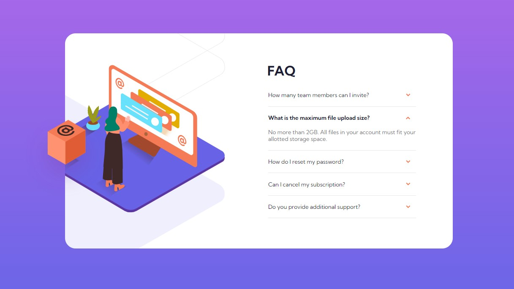

# Frontend Mentor - FAQ accordion card solution

This is a solution to the [FAQ accordion card challenge on Frontend Mentor](https://www.frontendmentor.io/challenges/faq-accordion-card-XlyjD0Oam). 

## Table of contents

- [Overview](#overview)
  - [The challenge](#the-challenge)
  - [Solution URL](#solution-url)
  - [Screenshot](#screenshot)
- [My process](#my-process)
  - [Built with](#built-with)
  - [What I learned](#what-i-learned)
  - [Continued development](#continued-development)

## Overview

### The challenge

Users should be able to:

- View the optimal layout for the component depending on their device's screen size
- See hover states for all interactive elements on the page
- Hide/Show the answer to a question when the question is clicked

### Solution URL
https://a-stepanian.github.io/FAQ-accordion-card/

### Screenshot
Desktop

Mobile

Hover Effect

Accordion Effect

## My process

### Built with

- Semantic HTML5 markup
- CSS custom properties
- Flexbox
- Mobile-first workflow

### What I learned
- Instead of individually selecting elements from the document and adding event listeners, I was able to use a loop to add them to each of the 5 questions very easily.
- Need to set the parent element position to relative in order for absolute positioning to give the desired effect on a child.
- In the desktop view, 3 of the svg images had to be cropped via overflow: hidden on the card.  In order to position the box picture so that it alone would overflow the edge of the card, I had to put a wrapper around the card move the box image outside of the card so it wasn't impacted by overflow:hidden.  Also needed to set the z-index to keep the box on top of everything.

### Continued development

- I was able to achieve the accordion effect by toggling classes on certain elements, but in the future I would like to return to this to revise the event listener so that all currently expanded question/answer elements will automatically collapse when a new question is clicked.
- I also plan to continue to work with the position property in CSS to continue learning how to manipulate images as needed.